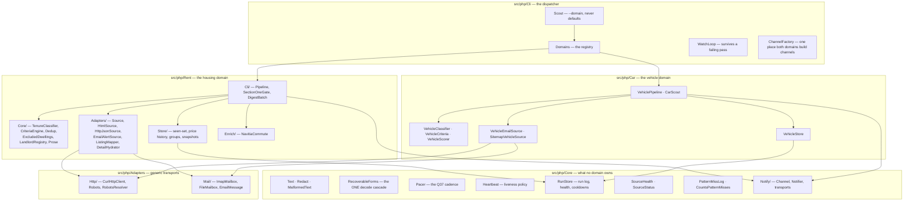
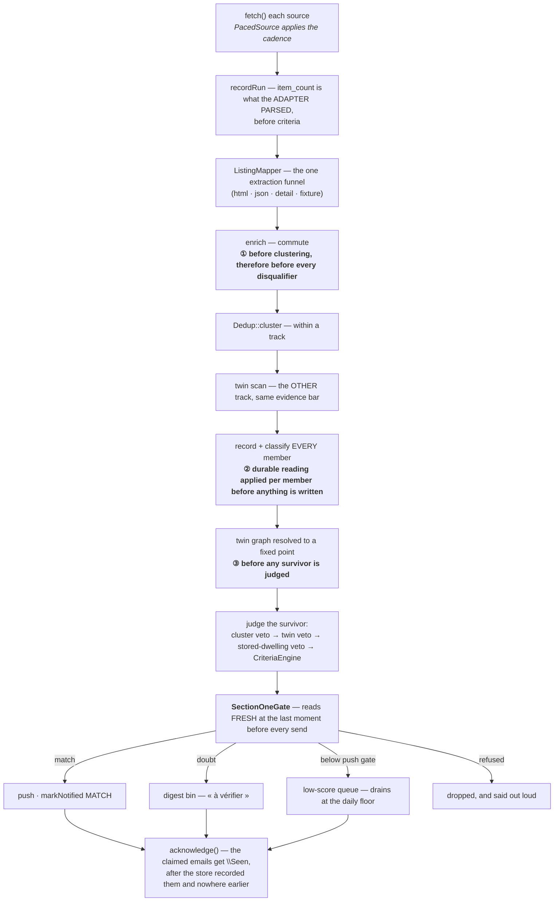

# Architecture

> **What this file is.** The shape of the program in one sitting: the layers, the lifecycle of a
> single pass, the one gate every announcement passes through, the three stores, the health model,
> the adapter types and the test architecture.
>
> **What it is not.** It is not the rules (`CLAUDE.md`), not the product specification
> (`spec/PROJECT_BRIEF.md`), not the operator's checklist (`docs/RUNBOOK.md`) and not the source
> register (`docs/SOURCES-LIVE.md`). Every claim below was read out of the code on **2026-09-08**;
> where a number can drift, the command that re-measures it is given instead of the number.

---

## 1. What the program is

One PHP binary, `bin/scout`, that watches for things and pushes a notification when one of them
matches. It runs two **domains** today:

| Domain | Watches | Store | Entry point |
|---|---|---|---|
| `--domain=rent` | rental listings in Île-de-France | `state/rent-watch.sqlite3` | `src/php/Rent/Cli/RentScout.php` |
| `--domain=car` | used cars | `state/car-watch.sqlite3` | `src/php/Car/Cli/CarScout.php` |

`src/php/Cli/Scout.php` is the dispatcher and **never defaults** — `bin/scout doctor` without a
domain is refused, because a defaulting dispatcher silently runs the wrong watcher. The domain
registry is `src/php/Cli/Domains.php`; adding a third domain is one entry there.

No runtime Composer dependencies. PHP 8.5, PSR-4 `Scout\` → `src/php/`, `vendor/` is 56 KB of
generated autoloader. The test runner is PHPUnit's official PHAR at `tools/phpunit.phar`
(gitignored; `bash tools/fetch-phpunit.sh` pins its SHA-256).

---

## 2. Layer map



**The split rule.** A thing lives in `Core/` when it belongs to neither domain — a portal changing
its email template is neither a housing fact nor a vehicle one, so `PatternMissLog` moved there. A
thing lives in `Rent/` or `Car/` when it encodes that domain's judgement. Two consequences worth
knowing:

- `Core/RunStore` (run log, health verdicts, feed silence, alert cooldowns) is **composed**, not
  inherited, by both domain stores, on its own PDO handle, with **its own `run_meta` version table**
  — it must not adopt `schema_meta`, because the rent file records `12` there and a v1 store reading
  it would refuse to open the database that produces the matches.
- `Core/Notify/` holds every channel and transport; `Rent/Notify/Formatter.php` and
  `Car/VehicleFormatter.php` compose the message text. Channels are shared, wording is not.

---

## 3. The lifecycle of one pass

Read out of `Rent\Cli\Pipeline::runOnce()`. The ordering below is load-bearing at four points, each
flagged.



**① Enrichment is upstream of everything.** Two independent reasons, either alone deciding it: a
disqualifier applied before enrichment rejects on a field enrichment would have filled (hard rule 8,
and silent over-rejection is invisible because nothing arrives); and the schema-v7 snapshot is
written from the member exactly as the classifier consumed it, so a listing enriched later would be
re-judged by `reclassify` without its commute and silently score lower the second time. Clustering
is downstream because `$observed` is keyed on **object identity**.

**② Every member is recorded and classified, not only the survivor.** Survivorship follows the
harvest order and `Pacer` shuffles it every pass, so a row holding yesterday's excluded reading would
lose it the moment a sibling was polled first. The durable reading is therefore applied per member,
before anything is written — there is no window in which it is off disk.

**③ The twin graph is resolved to a fixed point** before any survivor is judged, because the veto is
not transitive: A links B, B links C, and C is outside A's tolerance band.

**④ `acknowledge()` runs after the store recorded the pass**, never earlier — a crash between the
flag and the write would lose the listings while marking their mail read.

The car pipeline (`Car\VehiclePipeline`) is the same shape with three stages absent: no tenure, no
clustering across tracks, no detail hydration.

---

## 4. §1 — the one non-negotiable rule, and the one gate

The product rule is in `CLAUDE.md` and `spec/PROJECT_BRIEF.md`: French **social housing** (PLAI,
PLUS, PLS, ANRU, ANAH, `conventionné` absent an explicit intermediate label) is an *eligibility*
fact, not a preference. It is not user-overridable and has no config key.

Mechanically it is judged from **four persisted routes**, across **three announcing surfaces**:

| Route | Where it lives | What it says |
|---|---|---|
| the row's own durable reading | `listings.tenure` (schema v3) | what THIS row last read |
| the group veto | `listings.group_key` (v4) | what any sibling in the cluster read |
| the cross-track twin | `twin_tenure` / `twin_source` (v12) | what the other track read about the same flat |
| the same dwelling under another ad id | `Rent\Core\ExcludedDwellings` | what a different ad for this flat read |

| Surface | Entry point |
|---|---|
| the live pass | `Rent\Cli\Pipeline::runOnce()` |
| the digest drain | `RentScout::digest()` · `floorDigest()` · `DigestBatch` |
| `reclassify` | `RentScout::reclassify()` |

Four routes × three surfaces is twelve cells. Three certification rounds each found the majority of
their defects **inside the previous round's fixes** — patching one cell leaves eleven. So:

**`Rent\Cli\SectionOneGate` reads all four routes, fresh, at the last moment before every send.**
Nothing hoisted, nothing cached (a hoisted read is stale the moment the loop it guards writes to what
it read). The per-route checks upstream stay — they shape the verdict and short-circuit work — but
the gate is what makes their ordering stop mattering.

Two guards prevent recurrence, and both work **by discovery rather than by enumeration**:

- `tests/php/Repo/SectionOneGateCallSitesTest.php` finds every *method* under `src/php/Rent`
  containing a `notifier->send(` and fails when one does not consult the gate in that same method. An
  announcing surface is a **send**, not a notification kind.
- `tests/php/Repo/ExcludedDwellingsCallersTest.php` discovers the real call sites and fails when the
  class's own enumeration is stale. (A hand-maintained count was wrong twice, each time in the very
  commit that edited the line saying the count was load-bearing.)

**The digest bin is an announcement.** §1 was implemented for five rounds as *"never a MATCH"*, so
the digest read as a destination rather than as something that reaches the phone. Its refusal is
deliberately **different** from the match gate's: a row refused at the bin is dropped and said out
loud, never written `REJECT` with a derived durable reading — a doubt the pipeline could not resolve
is not a regime it read.

**Scope.** The gate and both guards are rent-only. The car domain persists no §1 route — its
excluded-vehicle set (`accidenté`, `gagé`, `opposition`, `épave`, VEI, VGE, *pour pièces*…) lives in
`Car\VehicleClassifier` and is likewise non-overridable, and is covered by the same PostToolUse
tripwire (`.claude/hooks/tenure-guard.sh`, one hook for both vocabularies).

### The classifier's signal tiers

`Rent\Core\TenureClassifier` reads five tiers, highest confidence first; a lower tier never overrides
a higher one:

1. **Explicit structured field** — `financement`, `typeProduit`, `categorie`.
2. **Explicit label in text** — accent- and case-folded (`Core\Text`).
3. **Procedural tells** — `numéro unique`, `SNE`, `commission d'attribution` ⇒ social.
4. **Plafonds de ressources** — `Rent\Core\PlafondBands`, from two dated official publications. It
   concludes in **one direction only**: strictly below the lowest intermediate ceiling in
   Île-de-France, the financing is social. Above that it emits nothing — manufacturing eligibility
   from a number is the dangerous direction.
5. **Source default** — lowest confidence. An *absent* signal lowers confidence; it never inherits
   the default at full confidence.

In front of tier 5 sits `Rent\Core\LandlordRegistry`: a private-portal card whose advertiser names
itself a bailleur is judged with **that landlord's** profile, not the portal's. It only ever tightens
(`stricterOf()`), and it needs a per-source `advertiser_pattern` — a source configuring none gets no
substitution.

---

## 5. Configuration

```
config/rent/criteria.json        committed — what a good flat is
config/rent/criteria.local.json  gitignored — overrides field by field (commute lives here)
config/rent/sources.json         committed — the source definitions and their field maps
config/car/criteria.json         committed
config/car/sources.json          committed
.env                             gitignored — every secret; .env.example is the template
```

**JSON, not YAML** (ruled 2026-08-07, Q22): there is no `ext-yaml` here and no way to install one.
JSON has no comments, so **any key beginning with `_` is ignored** and every other unrecognised key
is a hard error — that second half is what stops the convention swallowing a typo. A `_`-prefixed
note is a comment only while the key it annotates exists.

**Filters are two mechanisms, and they are not interchangeable** (hard rule 8):

| | Hard disqualifier | Score component |
|---|---|---|
| effect | rejects, silently, logged only | orders results, 0–100 |
| rent | `max_rent_cc` (charges comprises) | rent headroom |
| geography | `postcode_prefixes` (region mode) / `communes` | `commune_rank` |
| size | `min_rooms`, `min_surface_m2` | surface |
| kind | `exclude_patterns`, `exclude_title_patterns` | — |
| ratio | `min_price_per_m2` → **digest**, never reject | — |
| transit | *never* | commute (heaviest component) |
| building | *never* | lift, high-floor-without-lift penalty |

`null` is not zero (hard rule 9). An unknown rent, surface or room count means *unknown*, not *below
the minimum*; `floor === 0` is RDC and real; `elevator === false` and `elevator === null` are
different facts. This is enforced at the display layer too — an unmentioned lift says nothing while
an explicit absence says *sans ascenseur*.

**Location has two modes.** `communes: []` is REGION MODE: the name is not checked and
`postcode_prefixes` is the entire location filter. The loader **refuses both being empty** — that is
the one shape of this config that fails open, and over-matching is invisible because it looks like a
busy market. In region mode an unknown postcode is refused; with a commune list it is forgiven,
because there the name already matched.

---

## 6. Adapters — the only site-specific code

Every source implements `Rent\Adapters\Source` (or `Car\VehicleSource`):

```php
name(): string
family(): string                       // 'institutional' | 'private'  (car: 'portal' | 'dealer' | 'auction')
defaultTenure(): ?Tenure               // a hint; the classifier still runs
profile(): SourceProfile               // the default + mixed_tenure, what LandlordRegistry may tighten
host(): ?string                        // null = issues no outbound request, so it is never paced
fetch(): RawListing[]
health(?string $nowIso = null): SourceHealth   // the clock is what makes STALE derivable
```

| Type | Class | How it reads a listing |
|---|---|---|
| `html` | `Rent\Adapters\HtmlSource` | CSS selectors over repeated card elements, on PHP 8.5's own `Dom\HTMLDocument`. Field maps are selectors with an optional `@attr` and an optional `=> regex` capture. Supports `detail_map` — a second map resolved against the listing's own page. |
| `json` | `Rent\Adapters\HttpJsonSource` | `items_path` + a field map of JSON paths. `embedded_json_selector` pulls the JSON out of a `<script>` tag first, then the ordinary path runs. |
| `email_alert` | `Rent\Adapters\EmailAlertSource` | IMAP (`Adapters\Mail\ImapMailbox`) or a directory of `.eml` (`FileMailbox`). Positional regex readers, per-source. |
| `sitemap_jsonld` | `Car\SitemapVehicleSource` | sitemap walk + JSON-LD on each detail page. |
| `fixture` | `Rent\Adapters\FixtureSource` | a frozen payload on disk. Ships `enabled: false`. |
| `browser` | (declared, refused) | Playwright, opt-in, `legal_risk: true`. Never enabled. |

**Extraction has exactly one funnel per shape.** `ListingMapper` is where every html, json and detail
extraction lands, so hard rule 9 has one implementation rather than five. `DetailHydrator` is the
second-request path, extracted so an email source can compose the same one.

**A detail map addresses the LISTING, never the page.** Measured on a frozen payload: a listing's own
`.description` classifies correctly, and the same listing fed its whole detail page classifies
`UNKNOWN` — page furniture ("Commission d'attribution", "demande de logement social") is present on
social and intermediate listings alike and conflicts a correct verdict away. The detail path
deliberately does not add `_text`, so a detail map contributes only what it selects.

**Detail hydration is gated by the cache, not by a predicate.** The gate is *novelty*, and it lives
in the schema-v6 `listing_detail` table keyed on `(source, external_id)` — never on `dedup_key`,
because normalisation evolves and a row keyed on a conclusion orphans the whole cache the day it
changes. A page already on record costs no request ever again, so steady state is zero extra
requests. A per-pass budget (`detail_budget_per_pass`, default 20; an explicit `0` is refused at
load) bounds the cold start. Priority rank 0 is *not yet in the seen-set* — ranked lower, backlog
eats the budget while a genuinely new listing is notified unhydrated.

### The legal posture, enforced in code

- **Email-alert ingestion is the primary path for private portals** — within ToS, no bot to detect,
  and faster than polling because alerts fire on publication.
- **`robots.txt` is checked at runtime**, on the index, on every paginated page and on each detail
  page. `Adapters\Http\RobotsResolver` returns a **fail-closed** verdict for a source whose origin it
  cannot derive — `null` would mean *never check*, which is what it silently meant for a while.
  Status handling is deliberately non-uniform: `2xx` parses **only if the body looks like a robots
  file** (an SPA catch-all answering `200 text/html` parses to zero directives and would read as
  *allow everything*); `404`/`410` allow, per RFC 9309 §2.3.1.3; everything else including `403` and
  `5xx` fails closed.
- **No CAPTCHA solving, no proxy rotation, no fingerprint spoofing.** Two sources are refused on this
  ground and are rulings rather than capability limits — do not revisit them with a headless browser.
- `Core\Pacer` holds the cadence: **15 min ± 5 between passes, 5 s between distinct hosts, 60 s per
  host, order shuffled each pass**. `Rent\Adapters\PacedSource` is the decorator that applies it, so
  `Pipeline` never learns that time exists and `--once` stays unpaced.

---

## 7. The stores

Three SQLite files, three independent version counters.

| File | Owner | Version key | Tables |
|---|---|---|---|
| `state/rent-watch.sqlite3` | `Rent\Store\Store` | `schema_meta` (**v12**) | `listings`, `price_history`, `listing_detail`, `commute_cache` |
| `state/car-watch.sqlite3` | `Car\VehicleStore` | `vehicle_meta` (**v1**) | `vehicle_listings`, `vehicle_price_history` |
| both, composed | `Core\RunStore` | `run_meta` (**v1**) | `source_runs`, `source_alerts` |

> Observed 2026-09-08: the car file also carries a `schema_meta` row reading `12`, left from before
> `RunStore` was split out of the rent store on 2026-09-01. `VehicleStore` reads `vehicle_meta`, so
> the row is vestigial rather than active — but do not treat `schema_meta` as the car version.

**What the store guarantees**, by test category — a new store behaviour without a category is a
behaviour nobody decided to guarantee:

`identity` (nothing collapses onto a shared key) · `order` (a stale sighting manufactures no price
drop) · `rent events` (a drop, a rise, an unknown rent and a rent that vanishes are four facts) ·
`time` (a trailing `Z` is UTC on any host timezone; the DST gap is an instant) · `health` · `feed
freshness` · `seen-set` (*seen* and *notified* are different facts; so is *what* it was announced as)
· `group` · `evidence` (the v7 snapshot round-trips with hard rule 9 intact) · `twin` · `own
reading` · `persistence` · `concurrency` (WAL, and a second writer that waits) · `failure paths` ·
`secrets`.

**Two things about the seen-set are operationally load-bearing.** Deleting it re-notifies the entire
market. And the price history is not reconstructible — a listing only ever shows its *current* rent.
`tools/backup-state.sh` uses SQLite's **online-backup API**, never `cp`: the watcher holds the file
open in WAL, and a torn byte copy opens without complaint and reports a plausible row count. It reads
the copy back before reporting success.

---

## 8. Source health — the model, and what each verdict measures

Hard rule 2: *a broken source is indistinguishable from a quiet market unless something says so*, and
an alert computed and never sent is worse than none. `Core\SourceStatus`:

| Status | What it means | The measurement behind it |
|---|---|---|
| `NEVER_RUN` | no run recorded | — |
| `NEVER_PRODUCED` | runs, never a listing | a source misconfigured on the day it was added must not hide |
| `STALE` | the **watcher** stopped | needs a clock — `doctor` and the loop must pass `$nowIso` |
| `OK` | healthy | names any tolerated failure, on **every** verdict |
| `WARN_DROP` | count fell past 70 % of the rolling mean | a drifted selector |
| `WARN_FLAKY` | intermittent failures | keeps the whole run log — this one is about *attempts* |
| `BROKEN` | `EMPTY_RUNS_BEFORE_BROKEN` consecutive empty runs against a non-zero baseline | — |
| `FEED_SILENT` | the **portal** stopped | a source re-read one frozen email for 263 passes and every verdict said healthy |

Two refinements are worth knowing before touching `RunStore::health()`:

- **A failed run's `item_count` of 0 is *unknown*, not *zero listings*** (hard rule 9 at the health
  layer). Count-based verdicts judge the log with sub-threshold trailing failure episodes removed;
  `STALE` and `WARN_FLAKY` keep the whole log on purpose. Without the strip, one portal hiccup cost
  two emails — *broken* then *rétablie* — and wiped the alert cooldown: 77 flap emails in four days.
- **The strip needs an observation behind it.** A source whose entire history is failures still
  reports `BROKEN`.

**Verify a health change against a copy of the live store**, never with `doctor` — `doctor` polls and
writes a run into the baseline:

```bash
sqlite3 state/rent-watch.sqlite3 ".backup /tmp/probe.sqlite3"
```

`Core\PatternMissLog` is the other half of the same problem one layer down: every adapter counts how
often a **configured** extraction key came back null, and speaks at 100 %. It reports through
`Core\CountsPatternMisses`, and `tests/php/Core/PatternMissEscalationTest.php` discovers every
implementor by reflection — the class check it replaced is exactly why the signal existed on one adapter of five.
Its blind spot is stated: a **partial** miss rate is silent by design.

---

## 9. Notification

```
Core/Notify/Notifier      → fan-out over the configured channels
Core/Notify/Channel       → ConsoleChannel · NtfyChannel · EmailChannel
                            transports: SmtpTransport · SendmailTransport · FileTransport
Core/Notify/NotificationKind  MATCH · PRICE_DROP · SOURCE_HEALTH · SOURCE_RECOVERED
                              DIGEST · ROLLUP · HEARTBEAT
Core/Notify/Priority          HIGH · NORMAL · LOW
```

Every notification carries its `score` and human-readable `reasons[]`.

**A channel is turned on in two places and neither alone is enough**: listed under `notify.channels`,
and its credentials present in `.env`. A channel listed without its credentials is disabled **loudly**
at startup.

**`console` is not a channel, and neither is `email` over `SMTP_TRANSPORT=file`.** Both write to the
machine and reach nobody, so neither counts as a delivery: such a run announces every match to the
terminal and marks nothing notified. It is not refused — `run --once` at a terminal is exactly that
shape — but it warns, `doctor` says so, and `test-notify` exits 1.

**Three emission paths**, and they are not interchangeable:

| Path | Trigger | Drains |
|---|---|---|
| individual push | a match at or above `notify.push_min_score` | immediately |
| the digest — *« à vérifier »* | a tenure doubt, or an implausible €/m² ratio | `scout --domain=rent digest`, and the daily floor |
| the low-score queue — *« vérifié, score bas »* | a match **below** the push gate | the same two drains |

The daily floor (`Rent\Core\DigestSchedule`, marker `state/rent-digest.txt`) runs **under `--watch`
only**, and is **silent on a day with nothing pending** — the heartbeat already carries daily
liveness, and leaving the window open is what makes *an unsent digest is retried* work. The car
domain's equivalent is a **rollup**, not a digest, because a car has no tenure doubt.

**A queued row is not proof of a low score.** The queue is *matched, and nobody was told* — which is
also exactly what a failed push leaves behind. Each drain therefore re-scores and splits, and it
re-scores **from the stored v7 snapshot with the stored classification**: it never re-forms a verdict.
(`reclassify` forms one; `digest` announces one. They look symmetrical and are not.)

**Liveness** is `Core\Heartbeat` (marker `state/rent-heartbeat.txt`, on the mounted volume so it
survives the container being replaced): a LOW-priority beat every `RENT_HEARTBEAT_HOURS`, **whether or
not anything matched** — that is the entire point. Its bias is always one beat too many: a cold start
is due, an unreadable marker is due, a marker in the future is due. There is deliberately **no Docker
`HEALTHCHECK`** — a dashboard nobody watches is not a liveness signal.

---

## 10. Test architecture

Five layers, each answering a question the one below it cannot.

| Layer | Command | Question it answers |
|---|---|---|
| unit + fixture suite | `php tools/phpunit.phar` | does the code do what the tests say? |
| **sabotage ledger** | `bash tests/sabotage-check.sh` | would the tests **notice** if it stopped? |
| repo guards | `tests/php/Repo/*.php` | is a rule applied on **every** surface, discovered rather than listed? |
| tripwires | `tests/test-tenure-guard.sh`, `tests/test-vehicle-guard.sh` | does the PostToolUse hook still fire? |
| drift gate | `bash .claude/skills/scout-repair/drift-scan.sh` | do the docs still describe what exists? |

**The ledger is the one that matters most here**, because every failure mode in this tree is *silent*:
a classifier that over-rejects looks exactly like a quiet rental market; a seen-set that stops
persisting looks like a stable one; a banned IP looks like every source going quiet at once. A green
suite proves the code passes the tests — only the sabotage run proves the tests would notice.

It is **sharded six ways** (`SABOTAGE_SHARD=<i>/<n>`, selecting by case *index* so the split is stable
whatever `SABOTAGE_FILTER` does) because one job outgrew GitHub's 360-minute hosted ceiling.
`fail-fast: false` is load-bearing: one shard's finding must not cancel the five about to find their
own. A **separate `sabotage-alert` job** holds the `issues: write` token, so six shards open one
issue, a green night closes the whole backlog, and a shard whose log is *missing* is named rather
than read as clean.

Three ledger meta-tests exist because the ledger itself has failed silently:

- `tests/test-sabotage-applies.sh` — every expression still **matches something**, checked one at a
  time (a compound case could rot one expression at a time and still report `ok`).
- `tests/test-sabotage-baseline.sh` — cases are judged in a **green** scratch tree. For 27 hours they
  were not, and ~375 cases reported `ok` while proving nothing.
- `tests/test-ci-workflow.sh` — `ci.yml` still wires every step, **by step name and by the API call
  that does the work**, since a name alone survives the body being gutted.

**Offline is structural, not a discipline.** `tests/bootstrap.php` sets `SCOUT_OFFLINE=1` and
`CurlHttpClient::send()` refuses any third-party host (loopback stays open — the wire tests need a
real socket). Before that, enabling one real source turned the suite into a crawler of a live
landlord's site.

**The classifier corpus** (`tests/fixtures/rent/tenure/corpus.json`) is language-neutral so both
implementations can read it. Every case declares its `provenance` and a test asserts the declared
counts, so the synthetic/captured gap is visible as data. Append captures as sources come online;
never renumber.

**The surface matrix** (`tests/php/Rent/Core/SurfaceMatrixTest.php`) takes the cross product of the
classifier's excluded vocabulary — read from the class **by reflection** — and every surface a
listing presents, and asserts no cell reaches a notification. It exists because eight review rounds
each found a defect of one shape: *a correct rule applied to a subset of the surfaces it belongs on*.
A per-fixture corpus only covers cells someone thought to write.

---

## 11. Two languages, and what is deliberately absent

`src/phorj/` is the second implementation of the **pure core only** — `models`, `tenure`, `criteria`,
`dedup` — diffed fixture-by-fixture against the same shared corpus. Everything touching IMAP, HTTP,
SQLite or SMTP stays PHP-only: phorj refuses to transpile those domains, so a whole-app port is
impossible by design rather than by omission (`docs/PHORJ-REQUIREMENTS.md`). It is **on indefinite
hold** (2026-08-19) — deprioritised, not blocked.

Ruled **non-goals**, not gaps: no auto-application or form submission to landlords; no multi-user
support; no web UI (a read-only HTML digest would be acceptable later).

`prototype/scout.py` is superseded reference material. It has **no tenure classifier at all** and
will happily surface excluded listings; it disqualifies an unknown room count; it swallows every
per-source exception. Findings *about* it are a useful catalogue of what to avoid — *"the prototype
does it this way"* is never authority.

---

## Where to go next

| You want | Read |
|---|---|
| to bring it up, or fix something that is down | [`docs/RUNBOOK.md`](RUNBOOK.md) |
| what each live source is and what it costs | [`docs/SOURCES-LIVE.md`](SOURCES-LIVE.md) |
| why a source was or was not adopted | [`docs/SOURCES.md`](SOURCES.md) |
| how it got here, dated | [`docs/HISTORY.md`](HISTORY.md) |
| every filter dimension considered | [`docs/FILTERS.md`](FILTERS.md) |
| the product ruling set | [`spec/PROJECT_BRIEF.md`](../spec/PROJECT_BRIEF.md) |
| the rules Claude works under here | [`CLAUDE.md`](../CLAUDE.md) |
