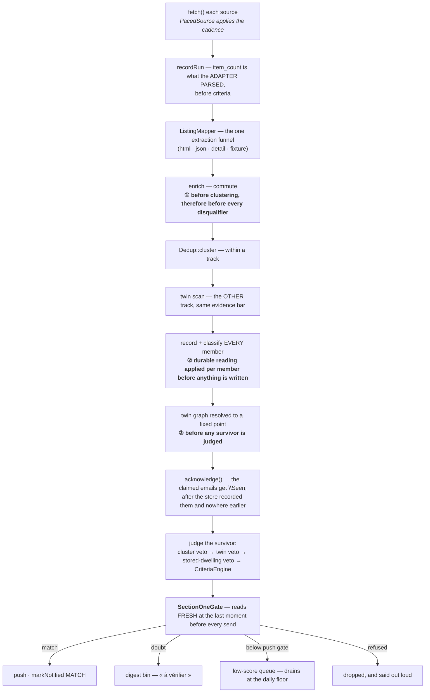

# Architecture

> **What this file is.** The shape of the program in one sitting: the layers, the lifecycle of a
> single pass, the one gate every announcement passes through, the stores, the health model,
> the adapter types and the test architecture.
>
> **What it is not.** It is not the rules (`CLAUDE.md`), not the product specification
> (`spec/PROJECT_BRIEF.md`), not the operator's checklist (`docs/RUNBOOK.md`) and not the source
> register (`docs/SOURCES-LIVE.md`). Every claim below was read out of the code on **2026-09-08** (the job domain on **2026-09-14**);
> where a number can drift, the command that re-measures it is given instead of the number.

---

## 1. What the program is

One PHP binary, `bin/scout`, that watches for things and pushes a notification when one of them
matches. It runs three **domains** today:

| Domain | Watches | Store | Entry point |
|---|---|---|---|
| `--domain=rent` | rental listings in Île-de-France | `state/rent-watch.sqlite3` | `src/php/Rent/Cli/RentScout.php` |
| `--domain=car` | used cars | `state/car-watch.sqlite3` | `src/php/Car/Cli/CarScout.php` |
| `--domain=job` | job offers — deployed 2026-09-14 as `job-scout` | `state/job-watch.sqlite3` | `src/php/Job/Cli/JobScout.php` |

`src/php/Cli/Scout.php` is the dispatcher and **never defaults** — `bin/scout doctor` without a
domain is refused, because a defaulting dispatcher silently runs the wrong watcher. The domain
registry is `src/php/Cli/Domains.php`; adding another domain is one entry there.

No runtime Composer dependencies. PHP 8.5, PSR-4 `Scout\` → `src/php/`, `vendor/` is 56 KB of
generated autoloader. The test runner is PHPUnit's official PHAR at `tools/phpunit.phar`
(gitignored; `bash tools/fetch-phpunit.sh` pins its SHA-256).

---

## 2. Layer map


```mermaid
flowchart TB
    subgraph CLI["src/php/Cli — the dispatcher"]
        Scout["Scout — --domain, never defaults"]
        Domains["Domains — the registry"]
        WatchLoop["WatchLoop — survives a failing pass"]
        ChannelFactory["ChannelFactory — one place every domain builds channels"]
    end

    subgraph CORE["src/php/Core — what no domain owns"]
        Text["Text · Whitespace · Redact · MalformedText"]
        Recover["RecoverableForms — the ONE decode cascade"]
        Pacer["Pacer — the Q37 cadence"]
        Heartbeat["Heartbeat — liveness policy"]
        RunStore["RunStore — run log, health, cooldowns"]
        Health["SourceHealth · SourceStatus"]
        Misses["PatternMissLog · CountsPatternMisses"]
        Notify["Notify/ — Channel, Notifier, transports"]
    end

    subgraph ADAPT["src/php/Adapters — generic transports"]
        Http["Http/ — CurlHttpClient, Robots, RobotsResolver"]
        Mail["Mail/ — ImapMailbox, FileMailbox, EmailMessage"]
    end

    subgraph RENT["src/php/Rent — the housing domain"]
        RCore["Core/ — TenureClassifier, CriteriaEngine, Dedup,<br/>ExcludedDwellings, LandlordRegistry, Prose"]
        RAdapt["Adapters/ — Source, HtmlSource, HttpJsonSource,<br/>EmailAlertSource, ListingMapper, DetailHydrator"]
        RStore["Store/ — seen-set, price history, groups, snapshots"]
        REnrich["Enrich/ — NavitiaCommute"]
        RCli["Cli/ — Pipeline, SectionOneGate, DigestBatch"]
    end

    subgraph CAR["src/php/Car — the vehicle domain"]
        VCore["VehicleClassifier · VehicleCriteria · VehicleScorer"]
        VAdapt["VehicleEmailSource · SitemapVehicleSource · AlcopaVehicleSource"]
        VStore["VehicleStore"]
        VCli["VehiclePipeline · CarScout"]
    end

    subgraph JOB["src/php/Job — the job domain"]
        JCore["JobClassifier · JobCriteria · JobScorer"]
        JAdapt["JobEmailSource · JobDigestEmailSource"]
        JStore["JobStore"]
        JCli["JobPipeline · JobScout"]
    end

    Scout --> Domains --> RCli & VCli & JCli
    RCli --> RCore & RAdapt & RStore & REnrich
    VCli --> VCore & VAdapt & VStore
    JCli --> JCore & JAdapt & JStore
    RAdapt --> Http & Mail
    VAdapt --> Http & Mail
    JAdapt --> Mail
    RCli --> Notify
    VCli --> Notify
    JCli --> Notify
    RStore --> RunStore
    VStore --> RunStore
    JStore --> RunStore
```

**The split rule.** A thing lives in `Core/` when it belongs to no domain — a portal changing
its email template is neither a housing fact nor a vehicle one, so `PatternMissLog` moved there. A
thing lives in `Rent/`, `Car/` or `Job/` when it encodes that domain's judgement. Two consequences worth
knowing:

- `Core/RunStore` (run log, health verdicts, feed silence, alert cooldowns) is **composed**, not
  inherited, by every domain store, on its own PDO handle, with **its own `run_meta` version table**
  — it must not adopt `schema_meta`, because the rent file records `12` there and a v1 store reading
  it would refuse to open the database that produces the matches.
- `Core/Notify/` holds every channel and transport; `Rent/Notify/Formatter.php`,
  `Car/VehicleFormatter.php` and `Job/JobFormatter.php` compose the message text. Channels are shared, wording is not.

---

## 3. The lifecycle of one pass

Read out of `Rent\Cli\Pipeline::runOnce()`. The ordering below is load-bearing at four points, each
flagged.


```mermaid
flowchart TD
    A["fetch() each source<br/><i>PacedSource applies the cadence</i>"] --> B["recordRun — item_count is what the ADAPTER PARSED,<br/>before criteria"]
    B --> C["ListingMapper — the one extraction funnel<br/>(html · json · detail · fixture)"]
    C --> D["enrich — commute<br/><b>① before clustering, therefore before every disqualifier</b>"]
    D --> E["Dedup::cluster — within a track"]
    E --> F["twin scan — the OTHER track, same evidence bar"]
    F --> G["record + classify EVERY member<br/><b>② durable reading applied per member before anything is written</b>"]
    G --> H["twin graph resolved to a fixed point<br/><b>③ before any survivor is judged</b>"]
    H --> O["acknowledge() — the claimed emails get \\Seen,<br/>after the store recorded them and nowhere earlier"]
    O --> I["judge the survivor:<br/>cluster veto → twin veto → stored-dwelling veto → CriteriaEngine"]
    I --> J["<b>SectionOneGate</b> — reads FRESH at the last moment before every send"]
    J -->|match| K["push · markNotified MATCH"]
    J -->|doubt| L["digest bin — « à vérifier »"]
    J -->|below push gate| M["low-score queue — drains at the daily floor"]
    J -->|refused| N["dropped, and said out loud"]
```

**① Enrichment is upstream of everything.** Two independent reasons, either alone deciding it: a
disqualifier applied before enrichment rejects on a field enrichment would have filled (hard rule 8,
and silent over-rejection is invisible because nothing arrives); and the schema-v7 snapshot is
written from the member exactly as the classifier consumed it, so a listing enriched later would be
re-judged by `reclassify` without its commute and silently score lower the second time. Clustering
is downstream because `$observed` is keyed on **object identity**.

**② Every member is recorded and classified, not only the survivor.** Survivorship follows the
harvest order and `Pacer` shuffles it every pass, so a row holding yesterday's excluded reading would
lose it the moment a sibling was polled first. The durable reading is therefore applied per member,
before anything is written — there is no window in which it is off disk.

**③ The twin graph is resolved to a fixed point** before any survivor is judged, because the veto is
not transitive: A links B, B links C, and C is outside A's tolerance band.

**④ `acknowledge()` runs after the store recorded the pass**, never earlier — a crash between the
flag and the write would lose the listings while marking their mail read. It sits *before* the
judging loop, not after the sends — the `ROW 36` loop follows the twin fixed-point sweep and
runs before `new SectionOneGate(…)` and the judging loop that gate feeds. (Cited by **symbol**, not
by line: the heartbeat entry in `CLAUDE.md` records a line citation there rotting twice in one round,
and a symbol survives an edit above it.) The flag says a message was **read**, not that anything in
it was notified — a pass that matches nothing still marks its mail, and a refused `acknowledge()` is
reported on the banner while the pass carries on, because the listings are already on disk.

The car pipeline (`Car\VehiclePipeline`) is the same shape with three stages absent: no tenure, no
clustering across tracks, no detail hydration. The job pipeline (`Job\JobPipeline`) is the car shape
again, over one email source.

---

## 4. §1 — the one non-negotiable rule, and the one gate

The product rule is in `CLAUDE.md` and `spec/PROJECT_BRIEF.md`: French **social housing** (PLAI,
PLUS, PLS, ANRU, ANAH, `conventionné` absent an explicit intermediate label) is an *eligibility*
fact, not a preference. It is not user-overridable and has no config key.

Mechanically it is judged from **four persisted routes**, across **three announcing surfaces**:

| Route | Where it lives | What it says |
|---|---|---|
| the row's own durable reading | `listings.tenure` (schema v3) | what THIS row last read |
| the group veto | `listings.group_key` (v4) | what any sibling in the cluster read |
| the cross-track twin | `twin_tenure` / `twin_source` (v12) | what the other track read about the same flat |
| the same dwelling under another ad id | `Rent\Core\ExcludedDwellings` | what a different ad for this flat read |

| Surface | Entry point |
|---|---|
| the live pass | `Rent\Cli\Pipeline::runOnce()` |
| the digest drain | `RentScout::digest()` · `floorDigest()` · `DigestBatch` |
| `reclassify` | `RentScout::reclassify()` |

Four routes × three surfaces is twelve cells. Three certification rounds each found the majority of
their defects **inside the previous round's fixes** — patching one cell leaves eleven. So:

**`Rent\Cli\SectionOneGate` reads all four routes, fresh, at the last moment before every send.**
Nothing hoisted, nothing cached (a hoisted read is stale the moment the loop it guards writes to what
it read). The per-route checks upstream stay — they shape the verdict and short-circuit work — but
the gate is what makes their ordering stop mattering.

Two guards prevent recurrence, and both work **by discovery rather than by enumeration**:

- `tests/php/Repo/SectionOneGateCallSitesTest.php` finds every *method* under `src/php/Rent`
  containing a `notifier->send(` and fails when one does not consult the gate in that same method. An
  announcing surface is a **send**, not a notification kind.
- `tests/php/Repo/ExcludedDwellingsCallersTest.php` discovers the real call sites and fails when the
  class's own enumeration is stale. (A hand-maintained count was wrong twice, each time in the very
  commit that edited the line saying the count was load-bearing.)

**The digest bin is an announcement.** §1 was implemented for five rounds as *"never a MATCH"*, so
the digest read as a destination rather than as something that reaches the phone. Its refusal is
deliberately **different** from the match gate's: a row refused at the bin is dropped and said out
loud, never written `REJECT` with a derived durable reading — a doubt the pipeline could not resolve
is not a regime it read.

**Scope.** The gate and both guards are rent-only. The car domain persists no §1 route — its
excluded-vehicle set (`accidenté`, `gagé`, `opposition`, `épave`, VEI, VGE, *pour pièces*…) lives in
`Car\VehicleClassifier` and is likewise non-overridable, and is covered by the same PostToolUse
tripwire (`.claude/hooks/tenure-guard.sh`, one hook for both vocabularies).

### The classifier's signal tiers

`Rent\Core\TenureClassifier` reads five tiers, highest confidence first; a lower tier never overrides
a higher one:

1. **Explicit structured field** — `financement`, `typeProduit`, `categorie`.
2. **Explicit label in text** — accent- and case-folded (`Core\Text`).
3. **Procedural tells** — `numéro unique`, `SNE`, `commission d'attribution` ⇒ social.
4. **Plafonds de ressources** — `Rent\Core\PlafondBands`, from two dated official publications. It
   concludes in **one direction only**: strictly below the lowest intermediate ceiling in
   Île-de-France, the financing is social. Above that it emits nothing — manufacturing eligibility
   from a number is the dangerous direction.
5. **Source default** — lowest confidence. An *absent* signal lowers confidence; it never inherits
   the default at full confidence.

In front of tier 5 sits `Rent\Core\LandlordRegistry`: a private-portal card whose advertiser names
itself a bailleur is judged with **that landlord's** profile, not the portal's. It only ever tightens
(`stricterOf()`), and it needs a per-source `advertiser_pattern` — a source configuring none gets no
substitution.

---

## 5. Configuration

```
config/rent/criteria.json        committed — what a good flat is
config/rent/criteria.local.json  gitignored — overrides field by field (commute lives here)
config/rent/sources.json         committed — the source definitions and their field maps
config/car/criteria.json         committed
config/car/sources.json          committed
config/job/criteria.json         committed
config/job/sources.json          committed
.env                             gitignored — every secret; .env.example is the template
```

**JSON, not YAML** (ruled 2026-08-07, Q22): there is no `ext-yaml` here and no way to install one.
JSON has no comments, so **any key beginning with `_` is ignored** and every other unrecognised key
is a hard error — that second half is what stops the convention swallowing a typo. A `_`-prefixed
note is a comment only while the key it annotates exists.

**Filters are two mechanisms, and they are not interchangeable** (hard rule 8):

| | Hard disqualifier | Score component |
|---|---|---|
| effect | rejects, silently, logged only | orders results, 0–100 |
| rent | `max_rent_cc` (charges comprises) | rent headroom |
| geography | `postcode_prefixes` (region mode) / `communes` | `commune_rank` |
| size | `min_rooms`, `min_surface_m2` | surface |
| kind | `exclude_patterns`, `exclude_title_patterns` | — |
| ratio | `min_price_per_m2` → **digest**, never reject | — |
| transit | *never* | commute (heaviest component) |
| building | *never* | lift, high-floor-without-lift penalty |

`null` is not zero (hard rule 9). An unknown rent, surface or room count means *unknown*, not *below
the minimum*; `floor === 0` is RDC and real; `elevator === false` and `elevator === null` are
different facts. This is enforced at the display layer too — an unmentioned lift says nothing while
an explicit absence says *sans ascenseur*.

**Location has two modes.** `communes: []` is REGION MODE: the name is not checked and
`postcode_prefixes` is the entire location filter. The loader **refuses both being empty** — that is
the one shape of this config that fails open, and over-matching is invisible because it looks like a
busy market. In region mode an unknown postcode is refused; with a commune list it is forgiven,
because there the name already matched.

---

## 6. Adapters — the only site-specific code

Every source implements `Rent\Adapters\Source` (or `Car\VehicleSource`):

```php
name(): string
family(): string                       // 'institutional' | 'private'  (car: 'portal' | 'dealer' | 'auction')
defaultTenure(): ?Tenure               // a hint; the classifier still runs
profile(): SourceProfile               // the default + mixed_tenure, what LandlordRegistry may tighten
host(): ?string                        // null = issues no outbound request, so it is never paced
fetch(): RawListing[]
health(?string $nowIso = null): SourceHealth   // the clock is what makes STALE derivable
```

| Type | Class | How it reads a listing |
|---|---|---|
| `html` | `Rent\Adapters\HtmlSource` | CSS selectors over repeated card elements, on PHP 8.5's own `Dom\HTMLDocument`. Field maps are selectors with an optional `@attr` and an optional `=> regex` capture. Supports `detail_map` — a second map resolved against the listing's own page. |
| `json` | `Rent\Adapters\HttpJsonSource` | `items_path` + a field map of JSON paths. `embedded_json_selector` pulls the JSON out of a `<script>` tag first, then the ordinary path runs. |
| `email_alert` | `Rent\Adapters\EmailAlertSource` | IMAP (`Adapters\Mail\ImapMailbox`) or a directory of `.eml` (`FileMailbox`). Positional regex readers, per-source. |
| `sitemap_jsonld` | `Car\SitemapVehicleSource` | sitemap walk + JSON-LD on each detail page. |
| `alcopa` | `Car\AlcopaVehicleSource` | site-specific: the saved search walked and count-checked, the lot page of each novel lot, a LIVE sale's page for its window. Carries the closing time auction rule 2 requires. |
| `fixture` | `Rent\Adapters\FixtureSource` | a frozen payload on disk. Ships `enabled: false`. |
| `browser` | (declared, refused) | Playwright, opt-in, `legal_risk: true`. Never enabled. |

**Extraction has exactly one funnel per shape.** `ListingMapper` is where every html, json and detail
extraction lands, so hard rule 9 has one implementation rather than five. `DetailHydrator` is the
second-request path, extracted so an email source can compose the same one.

**A detail map addresses the LISTING, never the page.** Measured on a frozen payload: a listing's own
`.description` classifies correctly, and the same listing fed its whole detail page classifies
`UNKNOWN` — page furniture ("Commission d'attribution", "demande de logement social") is present on
social and intermediate listings alike and conflicts a correct verdict away. The detail path
deliberately does not add `_text`, so a detail map contributes only what it selects.

**Detail hydration is gated by the cache, not by a predicate.** The gate is *novelty*, and it lives
in the schema-v6 `listing_detail` table keyed on `(source, external_id)` — never on `dedup_key`,
because normalisation evolves and a row keyed on a conclusion orphans the whole cache the day it
changes. A page already on record costs no request ever again, so steady state is zero extra
requests. A per-pass budget (`detail_budget_per_pass`, default 20; an explicit `0` is refused at
load) bounds the cold start. Priority rank 0 is *not yet in the seen-set* — ranked lower, backlog
eats the budget while a genuinely new listing is notified unhydrated.

### The legal posture, enforced in code

- **Email-alert ingestion is the primary path for private portals** — within ToS, no bot to detect,
  and faster than polling because alerts fire on publication.
- **`robots.txt` is checked at runtime**, on the index, on every paginated page and on each detail
  page. `Adapters\Http\RobotsResolver` returns a **fail-closed** verdict for a source whose origin it
  cannot derive — `null` would mean *never check*, which is what it silently meant for a while.
  Status handling is deliberately non-uniform: `2xx` parses **only if the body looks like a robots
  file** (an SPA catch-all answering `200 text/html` parses to zero directives and would read as
  *allow everything*); `404`/`410` allow, per RFC 9309 §2.3.1.3; everything else including `403` and
  `5xx` fails closed.
- **No CAPTCHA solving, no proxy rotation, no fingerprint spoofing.** Two sources are refused on this
  ground and are rulings rather than capability limits — do not revisit them with a headless browser.
- `Core\Pacer` holds the cadence: **15 min ± 5 between passes, 5 s between distinct hosts, 60 s per
  host, order shuffled each pass**. `Rent\Adapters\PacedSource` is the decorator that applies it, so
  `Pipeline` never learns that time exists and `--once` stays unpaced.

---

## 7. The stores

Three SQLite files, four independent version counters — the fourth belongs to a store every file carries.

| File | Owner | Version key | Tables |
|---|---|---|---|
| `state/rent-watch.sqlite3` | `Rent\Store\Store` | `schema_meta` (**v12**) | `listings`, `price_history`, `listing_detail`, `commute_cache` |
| `state/car-watch.sqlite3` | `Car\VehicleStore` | `vehicle_meta` (**v1**) | `vehicle_listings`, `vehicle_price_history` |
| `state/job-watch.sqlite3` | `Job\JobStore` | `job_meta` (**v1**) | `job_listings` |
| all three, composed | `Core\RunStore` | `run_meta` (**v1**) | `source_runs`, `source_alerts` |

> Observed 2026-09-08: the car file also carries a `schema_meta` row reading `12`, left from before
> `RunStore` was split out of the rent store on 2026-09-01. `VehicleStore` reads `vehicle_meta`, so
> the row is vestigial rather than active — but do not treat `schema_meta` as the car version.

**What the store guarantees**, by test category — a new store behaviour without a category is a
behaviour nobody decided to guarantee:

`identity` (nothing collapses onto a shared key) · `order` (a stale sighting manufactures no price
drop) · `rent events` (a drop, a rise, an unknown rent and a rent that vanishes are four facts) ·
`time` (a trailing `Z` is UTC on any host timezone; the DST gap is an instant) · `health` · `feed
freshness` · `seen-set` (*seen* and *notified* are different facts; so is *what* it was announced as)
· `group` · `evidence` (the v7 snapshot round-trips with hard rule 9 intact) · `twin` · `own
reading` · `persistence` · `concurrency` (WAL, and a second writer that waits) · `failure paths` ·
`secrets`.

**Two things about the seen-set are operationally load-bearing.** Deleting it re-notifies the entire
market. And the price history is not reconstructible — a listing only ever shows its *current* rent.
`tools/backup-state.sh` uses SQLite's **online-backup API**, never `cp`: the watcher holds the file
open in WAL, and a torn byte copy opens without complaint and reports a plausible row count. It reads
the copy back before reporting success.

---

## 8. Source health — the model, and what each verdict measures

Hard rule 2: *a broken source is indistinguishable from a quiet market unless something says so*, and
an alert computed and never sent is worse than none. `Core\SourceStatus`:

| Status | What it means | The measurement behind it |
|---|---|---|
| `NEVER_RUN` | no run recorded | — |
| `NEVER_PRODUCED` | runs, never a listing | a source misconfigured on the day it was added must not hide |
| `STALE` | the **watcher** stopped | needs a clock — `doctor` and the loop must pass `$nowIso` |
| `OK` | healthy | names any tolerated failure, on **every** verdict |
| `WARN_DROP` | count fell past 70 % of the rolling mean | a drifted selector |
| `WARN_FLAKY` | intermittent failures | keeps the whole run log — this one is about *attempts* |
| `BROKEN` | `EMPTY_RUNS_BEFORE_BROKEN` consecutive empty runs against a non-zero baseline | — |
| `FEED_SILENT` | the **portal** stopped | a source re-read one frozen email for 263 passes and every verdict said healthy |

Two refinements are worth knowing before touching `RunStore::health()`:

- **A failed run's `item_count` of 0 is *unknown*, not *zero listings*** (hard rule 9 at the health
  layer). Count-based verdicts judge the log with sub-threshold trailing failure episodes removed;
  `STALE` and `WARN_FLAKY` keep the whole log on purpose. Without the strip, one portal hiccup cost
  two emails — *broken* then *rétablie* — and wiped the alert cooldown: 77 flap emails in four days.
- **The strip needs an observation behind it.** A source whose entire history is failures still
  reports `BROKEN`.

**Verify a health change against a copy of the live store**, never with `doctor` — `doctor` polls and
writes a run into the baseline:

```bash
sqlite3 state/rent-watch.sqlite3 ".backup /tmp/probe.sqlite3"
```

`Core\PatternMissLog` is the other half of the same problem one layer down: every adapter counts how
often a **configured** extraction key came back null, and speaks at 100 %. It reports through
`Core\CountsPatternMisses`, and `tests/php/Core/PatternMissEscalationTest.php` discovers every
implementor by reflection — the class check it replaced is exactly why the signal existed on one adapter of five.
Its blind spot is stated: a **partial** miss rate is silent by design.

---

## 9. Notification

```
Core/Notify/Notifier      → fan-out over the configured channels
Core/Notify/Channel       → ConsoleChannel · NtfyChannel · EmailChannel
                            transports: SmtpTransport · SendmailTransport · FileTransport
Core/Notify/NotificationKind  MATCH · PRICE_DROP · SOURCE_HEALTH · SOURCE_RECOVERED
                              DIGEST · ROLLUP · HEARTBEAT
Core/Notify/Priority          HIGH · NORMAL · LOW
```

Every notification carries its `score` and human-readable `reasons[]`.

**A channel is turned on in two places and neither alone is enough**: listed under `notify.channels`,
and its credentials present in `.env`. A channel listed without its credentials is disabled **loudly**
at startup.

**`console` is not a channel, and neither is `email` over `SMTP_TRANSPORT=file`.** Both write to the
machine and reach nobody, so neither counts as a delivery: such a run announces every match to the
terminal and marks nothing notified. It is not refused — `run --once` at a terminal is exactly that
shape — but it warns, `doctor` says so, and `test-notify` exits 1.

**Three emission paths**, and they are not interchangeable:

| Path | Trigger | Drains |
|---|---|---|
| individual push | a match at or above `notify.push_min_score` | immediately |
| the digest — *« à vérifier »* | a tenure doubt, or an implausible €/m² ratio | `scout --domain=rent digest`, and the daily floor |
| the low-score queue — *« vérifié, score bas »* | a match **below** the push gate | the same two drains |

The daily floor (`Rent\Core\DigestSchedule`, marker `state/rent-digest.txt`) runs **under `--watch`
only**, and is **silent on a day with nothing pending** — the heartbeat already carries daily
liveness, and leaving the window open is what makes *an unsent digest is retried* work. The car
domain's equivalent is a **rollup**, not a digest, because a car has no tenure doubt.

**A queued row is not proof of a low score.** The queue is *matched, and nobody was told* — which is
also exactly what a failed push leaves behind. Each drain therefore re-scores and splits, and it
re-scores **from the stored v7 snapshot with the stored classification**: it never re-forms a verdict.
(`reclassify` forms one; `digest` announces one. They look symmetrical and are not.)

**Liveness** is `Core\Heartbeat` (marker `state/rent-heartbeat.txt`, on the mounted volume so it
survives the container being replaced): a LOW-priority beat every `RENT_HEARTBEAT_HOURS`, **whether or
not anything matched** — that is the entire point. Its bias is always one beat too many: a cold start
is due, an unreadable marker is due, a marker in the future is due. There is deliberately **no Docker
`HEALTHCHECK`** — a dashboard nobody watches is not a liveness signal.

---

## 10. Test architecture

Five layers, each answering a question the one below it cannot.

| Layer | Command | Question it answers |
|---|---|---|
| unit + fixture suite | `php tools/phpunit.phar` | does the code do what the tests say? |
| **sabotage ledger** | `bash tests/sabotage-check.sh` | would the tests **notice** if it stopped? |
| repo guards | `tests/php/Repo/*.php` | is a rule applied on **every** surface, discovered rather than listed? |
| tripwires | `tests/test-tenure-guard.sh`, `tests/test-vehicle-guard.sh` | does the PostToolUse hook still fire? |
| drift gate | `bash .claude/skills/scout-repair/drift-scan.sh` | do the docs still describe what exists? |

**The ledger is the one that matters most here**, because every failure mode in this tree is *silent*:
a classifier that over-rejects looks exactly like a quiet rental market; a seen-set that stops
persisting looks like a stable one; a banned IP looks like every source going quiet at once. A green
suite proves the code passes the tests — only the sabotage run proves the tests would notice.

It is **sharded six ways** (`SABOTAGE_SHARD=<i>/<n>`, selecting by case *index* so the split is stable
whatever `SABOTAGE_FILTER` does) because one job outgrew GitHub's 360-minute hosted ceiling.
`fail-fast: false` is load-bearing: one shard's finding must not cancel the five about to find their
own. A **separate `sabotage-alert` job** holds the `issues: write` token, so six shards open one
issue, a green night closes the whole backlog, and a shard whose log is *missing* is named rather
than read as clean.

Three ledger meta-tests exist because the ledger itself has failed silently:

- `tests/test-sabotage-applies.sh` — every expression still **matches something**, checked one at a
  time (a compound case could rot one expression at a time and still report `ok`).
- `tests/test-sabotage-baseline.sh` — cases are judged in a **green** scratch tree. For 27 hours they
  were not, and ~375 cases reported `ok` while proving nothing.
- `tests/test-ci-workflow.sh` — `ci.yml` still wires every step, **by step name and by the API call
  that does the work**, since a name alone survives the body being gutted.

**Offline is structural, not a discipline.** `tests/bootstrap.php` sets `SCOUT_OFFLINE=1` and
`CurlHttpClient::send()` refuses any third-party host (loopback stays open — the wire tests need a
real socket). Before that, enabling one real source turned the suite into a crawler of a live
landlord's site.

**The classifier corpus** (`tests/fixtures/rent/tenure/corpus.json`) is language-neutral so a second
implementation could read it — today only the PHP one does, phorj being on hold (§11). Every case declares its `provenance` and a test asserts the declared
counts, so the synthetic/captured gap is visible as data. Append captures as sources come online;
never renumber.

**The surface matrix** (`tests/php/Rent/Core/SurfaceMatrixTest.php`) takes the cross product of the
classifier's excluded vocabulary — read from the class **by reflection** — and every surface a
listing presents, and asserts no cell reaches a notification. It exists because eight review rounds
each found a defect of one shape: *a correct rule applied to a subset of the surfaces it belongs on*.
A per-fixture corpus only covers cells someone thought to write.

---

## 11. Two languages, and what is deliberately absent

**`src/phorj/` does not exist** — `src/` contains `php/` and nothing else (checked 2026-09-08). It
*would* be the second implementation of the **pure core only** — `models`, `tenure`, `criteria`,
`dedup` — diffed fixture-by-fixture against the same shared corpus. Everything touching IMAP, HTTP,
SQLite or SMTP would stay PHP-only: phorj refuses to transpile those domains, so a whole-app port is
impossible by design rather than by omission (`docs/PHORJ-REQUIREMENTS.md`). It is **on indefinite
hold** (2026-08-19) — deprioritised, not blocked, and not to be started.

Ruled **non-goals**, not gaps: no auto-application or form submission to landlords; no multi-user
support; no web UI (a read-only HTML digest would be acceptable later).

`prototype/scout.py` is superseded reference material. It has **no tenure classifier at all** and
will happily surface excluded listings; it disqualifies an unknown room count; it swallows every
per-source exception. Findings *about* it are a useful catalogue of what to avoid — *"the prototype
does it this way"* is never authority.

---

## File layout quick reference

Moved verbatim from `CLAUDE.md` on 2026-09-28 (review-remediation 5.4). Paths are relative to the repository
root.

```
.env.example                Committed template for every secret and path. `.env` itself is gitignored
spec/PROJECT_BRIEF.md       Full specification — the source of truth, and a ruling set
state/                      The SQLite seen-set, price history and run log. Gitignored, NOT scratch
prototype/                  Pre-existing single-file prototype. Reference only; do not extend in place
docs/OPEN-QUESTIONS.md      All 25 questions, each closed 2026-08-07 with the default applied
docs/ARCHITECTURE.md        The shape of the program in one sitting: layers, the lifecycle of one
                            pass read out of Pipeline::runOnce, the FOUR §1 routes x THREE announcing
                            surfaces and the one gate over them, the three stores and their three
                            independent version counters, the health model, the adapter types, and
                            the five test layers. Written 2026-09-08 from the code, not from this
                            file — CLAUDE.md carries sentences it marks stale itself
docs/RUNBOOK.md             The operator's checklist: zero-to-running, every verb and flag verified
                            against the three CLI parsers, the two contexts (host `bin/scout
                            --domain=rent` vs compose `run --rm rent-scout`, whose domain is in the
                            ENTRYPOINT), and a symptom->check->fix table. It LINKS README's
                            § Deploying it for the reasoning rather than restating it — a second copy
                            of a rationale is the copy that drifts
docs/SOURCES-LIVE.md        The live register for EVERY domain — adapter, identity scheme, rent
                            basis (CC vs HC), and the STATED COST of each enabled source (no
                            total here: this line said "sixteen" while the tree held twenty).
                            docs/SOURCES.md is rent-only and is a candidate catalogue, so the car
                            sources had no home anywhere until this file
docs/HISTORY.md             Dated build record derived from git log, plus the five failure patterns
                            this repo kept repeating (a true number on an invented cause; a fix
                            landing on one of two symmetric surfaces; n=1; a guarantee no fixture
                            reaches; green != deployed)
docs/plans/                 <topic>.plan.md, each with its own ## Decisions Log
config/<domain>/            criteria.json + sources.json per domain (committed) — JSON, ruled 2026-08-07 (Q22)
src/php/Cli/                Scout — the --domain dispatcher (never defaults) — Domains (the registry), WatchLoop, ChannelFactory
src/php/Core/               the GENERIC core: Text, Redact, Pacer, Heartbeat, source health, RunStore,
                            RecoverableForms (the ONE decode cascade — quoted-printable, header
                            unfolding, base64 blocks, base64url runs, percent-encoding — that
                            tools/scrub-eml.php and tests/php/Repo/FixtureSecretsTest.php BOTH call.
                            They were two copies and the copy was one decode short, so
                            base64(percent-encoded(address)) passed CI while the tool refused it),
                            PatternMissLog + CountsPatternMisses (extraction-miss counting and its
                            read side — moved out of Rent/Adapters 2026-09-01, because a portal
                            changing its template is neither a housing fact nor a vehicle one)
                            (run log + health, owned by no domain), SameFilterWarning (every card
                            of a source failing ONE hard filter — a drifted selector reads as a
                            quiet market), MalformedText, MutableByDesign, and the Notify channels
src/php/Rent/               the rent domain — Core (models, tenure classifier, criteria, dedup —
                            plus ExcludedDwellings, the §1 matcher for the SAME FLAT on record
                            under another ad id: the fourth persisted route, and the ONE
                            implementation its three announcing surfaces share — Pipeline, the
                            digest drain and reclassify; plus Heating and Amenities, the two Track 7
                            readers, which run over the mapped `description` and NOT over a
                            field-map entry — one more mapped field changes
                            `FieldMap::fingerprint()` and invalidates all 737 cached In'li detail
                            rows), Config, Adapters,
                            Store, Enrich, Notify (Formatter), Cli/RentScout
src/php/Car/                the car domain — the Vehicle* classes and Cli/CarScout
src/php/Job/                the job domain — the Job* classes and Cli/JobScout. Deployed as the
                            `job-scout` compose service since 2026-09-14
src/php/Core/Pacer.php      the Q37 cadence; clock, sleeper and RNG all injected so it is testable
src/php/Cli/WatchLoop.php   the `--watch` loop; survives a failing pass, stops after the one in flight
src/php/Rent/Adapters/PacedSource.php   decorator applying Pacer, so Pipeline never learns time exists
src/php/Rent/Store/              SQLite seen-set, price history, cross-portal group (v4); run log
                            delegated to Core/RunStore
src/phorj/                  phorj port of the same pure core                  [waits on phorj]
tests/php/                  PHPUnit suites — generic under Core/Adapters/Config/Cli, then Rent/… and Car/…
tests/fixtures/rent/tenure/      corpus.json — the language-neutral classifier corpus
tests/fixtures/<domain>/<source>/   Frozen payloads, one dir per source, under the domain that reads them
tests/fixtures/rent/seloger/     The first REAL portal alerts, scrubbed. Their AWKWARD structure is
                            the point — preamble, `=_?:` boundary, 2047 subject split mid-word.
                            The 003 capture is the TITLE one: four cards, not one of which the
                            old vocabulary pattern could read (`APARTMENT`, `T5`, `T3`)
tests/fixtures/rent/bienici/     The second portal's alerts. A five-card alert, a one-card alert whose
                            suggestion card makes it two, and a message with NO cards at all
tests/fixtures/rent/leboncoin/   The third portal's, and the first HTML-ONLY alert: no text/plain
                            part at all, so every URL lives in an href. n=1 — one message, three
                            cards, the first this subscription ever produced
tests/fixtures/rent/pap/         The fourth portal's, and the first DIRECT-FROM-OWNER one. ONE listing
                            per message, so no card_separator at all. The first captures quote the
                            alert's own SEARCH CRITERIA above the listing — the 45 m² floor the
                            first-match-wins surface reader returned instead of the flat's 50 —
                            which is what the positional anchors exist to defeat. The FIFTH is
                            here for its HEADER, not its flat: `Date: Sat, 5 Sep 2026`, the
                            single-digit day RFC 5322 allows and this repo's strict parser
                            refused for a month
tests/fixtures/job/linkedin/     The job domain's LinkedIn alerts, scrubbed — the scrubber learned their
                            per-recipient link tokens first. Cards are read from the HTML part
tests/fixtures/job/freework/     Free-Work's first digest (01, n=1 — 40 cards, 36 distinct) and a
                            profile reminder from the same sender (00) that must stay unclaimed.
                            Scrubbed after the tool learned Mailjet's click links
tests/fixtures/job/hellowork/    Four HelloWork alerts (01-04, one per saved search, 39 offers). Their
                            click tokens were rewritten in place, so each still decodes to its offer
tests/fixtures/job/collective/   Five Collective.work opportunity mails, one offer each: 01-04 the current
                            template (02/03 one offer re-posted under two ids), 05 the pre-2026-09 one
                            whose `é` is DECOMPOSED. Scrubbed with the subscriber's name as a needle
tests/fixtures/job/apec/         Apec's first saved-search digest (01, n=1 — 48 cards, 45 distinct) and a
                            weekly "Nos recommandations" mail (00) that must stay unclaimed. All 221
                            links survive the scrub DISTINCT — see the Apec bullet for why that matters
tests/fixtures/job/mindquest/    Mindquest's first alert, delivered twice (01, 02 — six offers each, two URL
                            shapes) and the account's sign-up confirmation (00) that must stay unclaimed
tests/fixtures/job/freelance-informatique/   Its first opportunity mail (01, n=1 — one offer, a direct
                            link, the skills line read as the description)
tools/scrub-eml.php         Turns a captured .eml into a committable fixture; REFUSES to write
                            while the address is RECOVERABLE — decoding base64url runs and
                            quoted-printable before it looks, not merely grepping for it
tools/dump-eml.php          Pulls several RAW .eml from the alert mailbox when Gmail's own
                            export is too slow — the newest inside a DATE window
                            (`DUMP_SINCE_DAYS`, default 7, `all` for history), read-only at
                            the protocol level (EXAMINE, BODY.PEEK), and its output is UNSCRUBBED by definition, so
                            scrub-eml.php is still owed afterwards. It REFUSES to write
                            anywhere under tests/, which is what makes it usable at all: the
                            one-step path from a mailbox to a committed fixture is how both
                            of this repo's leaks would happen again. That guard used to fail
                            OPEN on the bare `tests` and on an unresolvable parent — the
                            latter being the default out-dir's own shape on a fresh tree, so
                            it was vacuous by default. Docs: docs/ALERT-CAPTURE.md Part A′
tests/sabotage-check.sh     Proves the classifier suite detects a regression
tests/test-tenure-guard.sh  Proves the §1 tripwire fires, and stays quiet on ordinary PHP
tests/test-vehicle-guard.sh Same, for the CAR excluded set. ONE hook covers both domains:
                            the relaxation shapes are identical and only the vocabulary
                            differs, so a second hook would be two log formats and two
                            places to forget. Its own creation tripped the guard — the file
                            is nothing but the payloads it exists to catch — so it is
                            exempted by exact path beside its sibling
tests/test-fetch-phpunit.sh Proves the runner fetch refuses a bad signature
tests/test-drift-scan.sh    Proves drift-scan's S8 still fires — a gate nobody has seen red is untested
tests/test-sabotage-applies.sh   Proves no sabotage expression has rotted into matching nothing
tests/test-dotenv-cli.sh         Proves the .env loader behind every CLI verb
tests/test-scrub-eml.sh          Proves the scrubber refuses a RECOVERABLE address — the
                                 must-strip, must-refuse and must-stay-quiet halves
tests/test-dump-eml.sh           Proves the capture tool never writes under tests/ and never
                                 puts the IMAP password in a stack trace. Isolated: the tool
                                 is copied beside a STUB autoloader, so no case reads the
                                 real .env or reaches the network. It proves the trace
                                 mechanism on this machine's own PHP first — an argument
                                 leaks, a use-binding does not — then ties the tool to it
tools/verify-deploy.sh           Did the redeploy land? `up -d` printing Started is not a
                                 deployment: a wedged recreate leaves a watcher in `Created`,
                                 and `docker compose ps` without -a OMITS it, so the failure
                                 renders as a shorter list. Asserts every declared service
                                 has a RUNNING container, on the CURRENT image, that the
                                 IMAGE ITSELF postdates the newest src/ commit, and that no
                                 hex-prefixed leftover holds a name for the next recreate to
                                 die on. That last one is TWO verdicts since 2026-09-08: a
                                 dead leftover takes `docker rm -f`, while a renamed
                                 container the service still RESOLVES TO takes
                                 `up -d --force-recreate` and must not be removed — the tool
                                 certified one `running, image courante` and offered to
                                 delete it four lines below. A hex name from another compose
                                 project on this host is COUNTED, never named and never
                                 given a remedy — `docker ps -a` is machine-wide, and a
                                 silent drop reads exactly like a scan that found nothing.
                                 Read-only. The image-age check is a DIFFERENT
                                 question from the image-id one and the answer looks the
                                 same: "running, image courante" is true of a watcher whose
                                 image predates the fix by a day and a half, which is
                                 exactly what happened on 2026-09-04
tests/test-verify-deploy.sh      Its sabotage test — every failure state driven through a
                                 stub `docker`, counterweight FIRST. A missing image exits 2
                                 ("build it"), never 1 ("watcher down"): collapsing those
                                 would make a forgotten build read as a broken watcher.
                                 NO CASE COUNT IS WRITTEN HERE, deliberately: this line said
                                 "7 cases" and the very commit that added the eighth and
                                 ninth left it standing, because it sat in the same hunk as
                                 an untouched context line. Run it — the tally is its last
                                 line. Same rule as the skills list further down
tests/test-sabotage-baseline.sh  Proves the sabotage ledger judges its cases in a GREEN scratch tree
tests/test-ci-workflow.sh   Proves ci.yml still wires every step this file claims CI runs
tests/php/Adapters/Mail/ImapMailboxWireTest.php
                            The IMAP client ON THE WIRE, against scripted-imap-server.php
                            beside it (forked, loopback, transcript as evidence): a fetch is
                            EXAMINE + UID FETCH … BODY.PEEK[]; the one write is the \Seen
                            STORE on claimed, still-unseen UIDs, refused across a UIDVALIDITY
                            change. Row 36's guarantees, and this client's first wire test
tools/backup-state.sh       Backs up the seen-set — the one file this project calls
                            UNRECOVERABLE. SQLite's ONLINE backup API, never `cp`: the watcher
                            holds the db open in WAL, and a torn byte copy opens without
                            complaint and reports a plausible row count. Reads the copy back
                            before reporting success; keeps 7, oldest-first
tests/test-backup-state.sh  Sabotage test FOR that tool. Its own first draft collided every
                            backup onto one second-granularity filename and a `<= 7` assertion
                            hid it — the exact count is asserted now
tools/fetch-phpunit.sh      Fetches the runner; pinned SHA-256, refuses to install on a mismatch
tools/phpunit.phar          Test runner (gitignored — see README § Getting started)
var/claude/                 Reports, review outputs — gitignored scratch (handoffs are the
                            global PreCompact hook's job, not the repo's)
.claude/                    Project skills, reviewer agents, hooks, settings, and
                            progress.json — the adapter ~/.claude/bin/project-state.sh reads
                            (test_cmd, requires, cursor files). Without it `--record-test`
                            dies and no plan step can reach the `certified` state at all
.github/workflows/ci.yml    CI — suite+guards every push/PR, sabotage ledger nightly+dispatch
```

## Where to go next

| You want | Read |
|---|---|
| to bring it up, or fix something that is down | [`docs/RUNBOOK.md`](RUNBOOK.md) |
| what each live source is and what it costs | [`docs/SOURCES-LIVE.md`](SOURCES-LIVE.md) |
| why a source was or was not adopted | [`docs/SOURCES.md`](SOURCES.md) |
| how it got here, dated | [`docs/HISTORY.md`](HISTORY.md) |
| why the code is shaped the way it is — the dated engineering notes moved out of `CLAUDE.md` | [`docs/ENGINEERING-NOTES.md`](ENGINEERING-NOTES.md) |
| every filter dimension considered | [`docs/FILTERS.md`](FILTERS.md) |
| the product ruling set | [`spec/PROJECT_BRIEF.md`](../spec/PROJECT_BRIEF.md) |
| the rules Claude works under here | [`CLAUDE.md`](../CLAUDE.md) |
